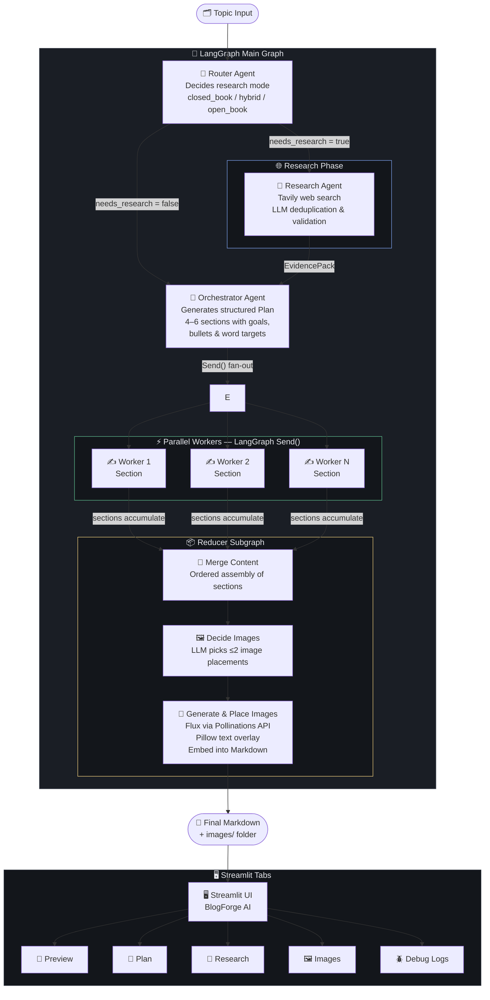

# ✦ BlogForge AI — Multi-Agent Content Generation System

> An end-to-end AI pipeline that researches, plans, writes, and illustrates technical blog posts — fully automated using LangGraph, Groq (LLaMA 3.3), Tavily, and a Streamlit UI.

---

##  Overview

BlogForge AI takes a single topic as input and produces a fully-formatted, research-backed Markdown blog post — complete with AI-generated cover images — in 1–2 minutes.

The system is built on a **multi-agent LangGraph pipeline** where specialised agents handle routing, web research, content planning, parallel section writing, and image generation — each with clearly scoped responsibilities.

---

##  Architecture



### Agent Roles

| Agent | Responsibility |
|---|---|
| **Router** | Decides whether web research is needed (`closed_book` / `hybrid` / `open_book`) and generates search queries |
| **Research** | Runs Tavily web searches, deduplicates and validates evidence items |
| **Orchestrator** | Produces a structured `Plan` (4–6 sections) with goals, bullets, word targets, and flags |
| **Worker (×N)** | Writes one section each in parallel, grounded by evidence and plan constraints |
| **Reducer** | Merges sections → decides images → generates images via Flux → embeds into final Markdown |

---

##  Features

- **Intelligent routing** — automatically selects `closed_book`, `hybrid`, or `open_book` mode based on topic volatility
- **Web research** — Tavily-powered search with LLM-driven deduplication and source quality filtering
- **Parallel writing** — LangGraph `Send()` fans out section tasks to worker agents concurrently
- **AI image generation** — Free Flux model via Pollinations API; images get professional text overlays with title/subtitle
- **Structured outputs** — All agents use Pydantic schemas (`Plan`, `Task`, `EvidencePack`, `ImageSpec`) for reliable, validated responses
- **Graceful degradation** — Image and research failures are caught and logged without blocking the pipeline
- **Streamlit UI** — Dark editorial interface with live preview, plan inspector, evidence viewer, image gallery, and debug logs
- **Download options** — Export as `.md` or a bundled `.zip` (Markdown + images folder)

---

##  UI Tabs

| Tab | Contents |
|---|---|
| **Preview** | Rendered blog with inline images and download buttons |
| **Plan** | Structured content plan table (sections, goals, word targets, flags) |
| **Research** | Evidence sources table (title, source domain, URL) |
| **Images** | Gallery of AI-generated images |
| **Logs** | Full JSON debug dump of pipeline state |

---

## 🛠️ Tech Stack

| Layer | Technology |
|---|---|
| Orchestration | [LangGraph](https://github.com/langchain-ai/langgraph) (StateGraph + subgraph) |
| LLM | [Groq](https://groq.com/) — `llama-3.3-70b-versatile` |
| Web Search | [Tavily](https://tavily.com/) |
| Image Generation | [Pollinations.ai](https://pollinations.ai/) (Flux model, free) |
| Image Processing | Pillow (text overlay rendering) |
| Data Validation | Pydantic v2 |
| UI | Streamlit |
| Environment | python-dotenv |

---

## 📁 Project Structure

```
blogforge-ai/
├── bwa_research_image.py   # Core multi-agent pipeline (LangGraph)
├── streamlit_blog.py       # Streamlit frontend UI
├── images/                 # Generated images (auto-created at runtime)
├── .env                    # API keys (not committed)
├── requirements.txt
└── README.md
```

---

## Getting Started

### 1. Clone the repository

```bash
git clone https://github.com/your-username/blogforge-ai.git
cd blogforge-ai
```

### 2. Install dependencies

```bash
pip install -r requirements.txt
```

### 3. Configure environment variables

Create a `.env` file in the project root:

```env
GROQ_API_KEY=your_groq_api_key
TAVILY_API_KEY=your_tavily_api_key
```

| Variable | Where to get it |
|---|---|
| `GROQ_API_KEY` | [console.groq.com](https://console.groq.com) |
| `TAVILY_API_KEY` | [app.tavily.com](https://app.tavily.com) |

### 4. Run the Streamlit app

```bash
streamlit run streamlit_blog.py
```

### 5. (Optional) Run the pipeline from the CLI

```bash
python bwa_research_image.py
```

This will generate a blog on `"Self Attention in Transformer Architecture"` by default and print the final Markdown to stdout.

---

##  How It Works — Step by Step

1. **Router** receives the topic and determines research mode + generates search queries if needed.
2. **Research Agent** (optional) queries Tavily, cleans results, and builds a deduplicated `EvidencePack`.
3. **Orchestrator** creates a structured `Plan` — 4 to 6 sections with goals, bullets, word targets, and flags like `requires_code` or `requires_citations`.
4. **Fan-out** dispatches each section as a parallel `Send()` to individual Worker agents.
5. **Workers** write their sections in Markdown, grounded by the plan and evidence, respecting citation and code constraints.
6. **Reducer subgraph** merges all sections in order, decides on up to 2 image placements, generates images via Flux, adds text overlays, and embeds them into the final Markdown document.
7. The final `.md` file is saved to disk and rendered in the Streamlit UI.

---

##  Requirements

```
langgraph
langchain-groq
langchain-core
langchain-community
tavily-python
pydantic
pillow
requests
streamlit
pandas
python-dotenv
```

> Generate a `requirements.txt` with `pip freeze > requirements.txt` after installing.

---

## 🔧 Configuration & Customisation

**Change the default topic** in `bwa_research_image.py`:
```python
if __name__ == "__main__":
    result = run("Your topic here")
```

**Adjust section count** — edit the `Plan` schema:
```python
tasks: List[Task] = Field(..., min_length=4, max_length=6)
```

**Swap the LLM model** — update the Groq model name:
```python
llm_strong = ChatGroq(model="llama-3.3-70b-versatile", ...)
```

**Image dimensions** — change the Pollinations URL in `generate_flux_image()`:
```python
url = f"...?width=1280&height=720&model=flux..."
```

---

##  Known Limitations

- Image generation depends on the free Pollinations API — availability and quality may vary
- LLaMA 3.3 on Groq has rate limits; large plans with many parallel workers may occasionally hit them (retries are configured)
- The `re` module is used in `research_node` but its import is missing from the top of `bwa_research_image.py` — add `import re` if you encounter a `NameError`
- Font rendering for image overlays requires `arial.ttf` to be available on the system; falls back to PIL's default font otherwise

---

##  License

MIT License — feel free to use, modify, and distribute.

---

##  Acknowledgements

- [LangChain / LangGraph](https://github.com/langchain-ai/langgraph) for the agent orchestration framework
- [Groq](https://groq.com/) for fast LLaMA inference
- [Tavily](https://tavily.com/) for research-grade web search
- [Pollinations.ai](https://pollinations.ai/) for free Flux image generation
